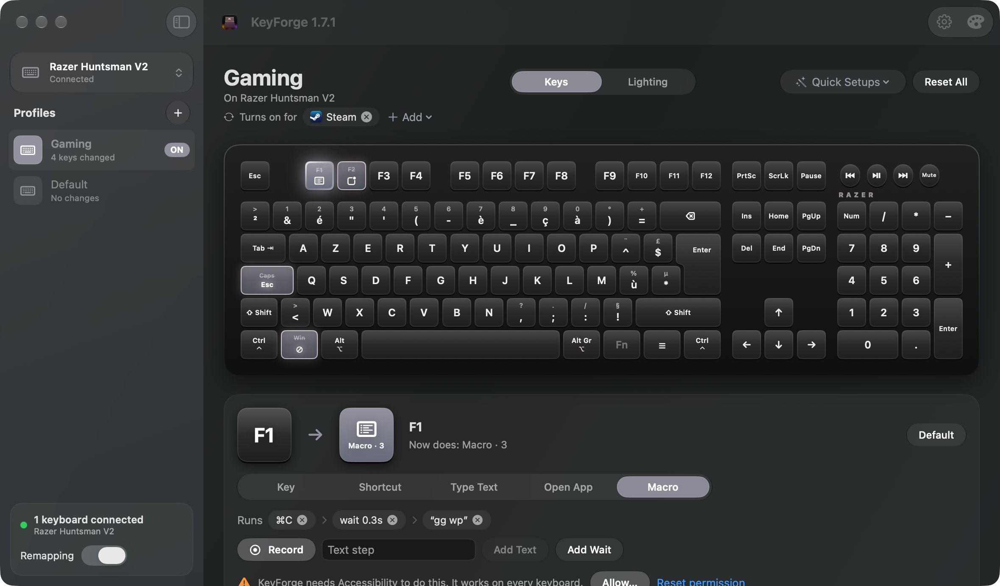
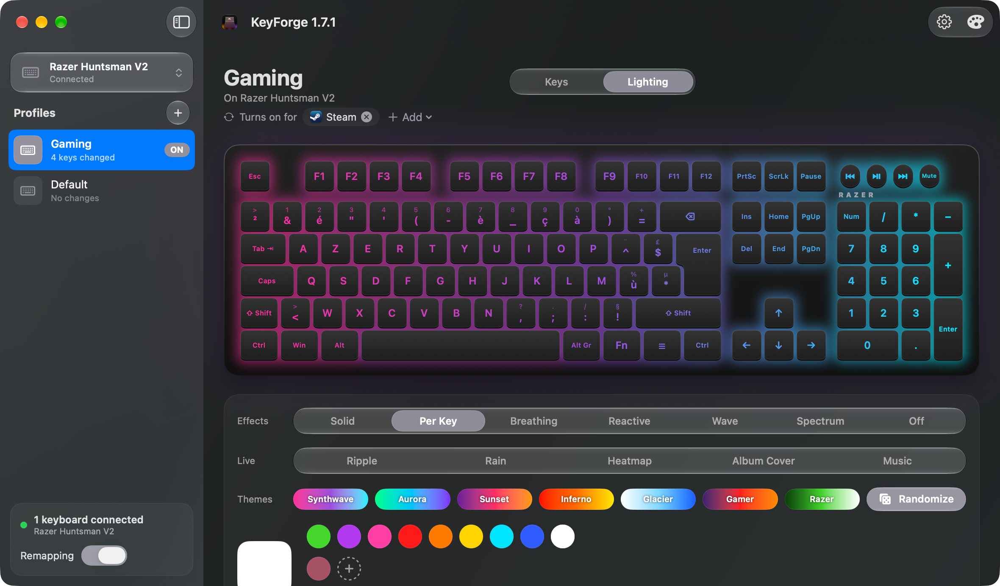

# KeyForge

A macOS app to remap keys, run shortcuts and macros, and control the RGB lighting of a Razer Huntsman V2, without Razer Synapse. Key remapping works with any keyboard. Made with Claude, sister app of [MP3 Tagger](https://github.com/silentrosehill/MP3Tagger).




## Features

**Keys**
- Your keyboard drawn on screen with your real layout's legends (AZERTY, QWERTZ, …); keys light up as you press them
- Click a key and choose what it does, or just press the key you want it to be
- Media keys, volume, brightness, Mission Control, Launchpad, Spotlight, Fn, or disable a key
- Make a key send a shortcut, type text, open an app, or run a macro (shortcuts, text and pauses in a row)
- Quick setups: Mac modifiers, Caps Lock → Esc, media on F7–F12, disable the Win keys for gaming

**Any keyboard**
- Pick any connected keyboard; each one has its own profiles, all active at the same time, plus "All keyboards"
- Layouts: Full + media (Huntsman V2), Full, TKL, 60% and Mac, ISO or ANSI

**Profiles**
- As many profiles as you want; rename, duplicate, reorder
- Switch automatically while a chosen app (like a game) is in front, and back when you leave it
- ⌃⌥1 … ⌃⌥9 switch profiles, with a small popup; also from the menu bar

**Lighting (Razer Huntsman V2)**
- Solid, Breathing, Reactive, Wave, Spectrum, Off, with brightness
- Per Key: paint keys by clicking or dragging, Randomize, and premade themes (Synthwave, Aurora, Sunset, Inferno, Glacier, Gamer, Razer)
- Live effects: Ripple on key presses, Rain, a typing Heatmap, Album Cover (follows the song playing in MP3 Tagger) and Music (reacts to what your Mac plays)
- Pick a color from anywhere on screen, save your own colors, Caps Lock light
- Talks to the keyboard directly over USB (the same protocol as OpenRazer); no Synapse needed

**App**
- Liquid Glass look like MP3 Tagger, theme colors, or colors that follow your keyboard's RGB
- Lives in the menu bar, opens at login, re-applies everything when the keyboard is plugged back in

## Notes

- Key remapping uses macOS's own `hidutil`, so it needs no driver. If Razer's driver extensions (from Razer Synapse) are still active, macOS ignores remapping on the Razer keyboard: turn them off in System Settings → General → Login Items & Extensions → Driver Extensions.
- Shortcuts, macros, Ripple and Heatmap need Accessibility (System Settings → Privacy & Security → Accessibility). They work on every keyboard, since macOS doesn't say which keyboard a key press came from.
- Music asks for permission to record system audio; nothing is recorded or saved.
- Lighting is only tested on the Huntsman V2 (USB 1532:026C). The LED map comes from OpenRGB.

## Build

Needs macOS 15 or later and the Xcode Command Line Tools.

```bash
git clone https://github.com/silentrosehill/KeyForge.git
cd KeyForge
./build.sh
open KeyForge.app
```

The app is signed ad hoc and not notarized, so macOS may ask you to allow it in System Settings → Privacy & Security the first time.
